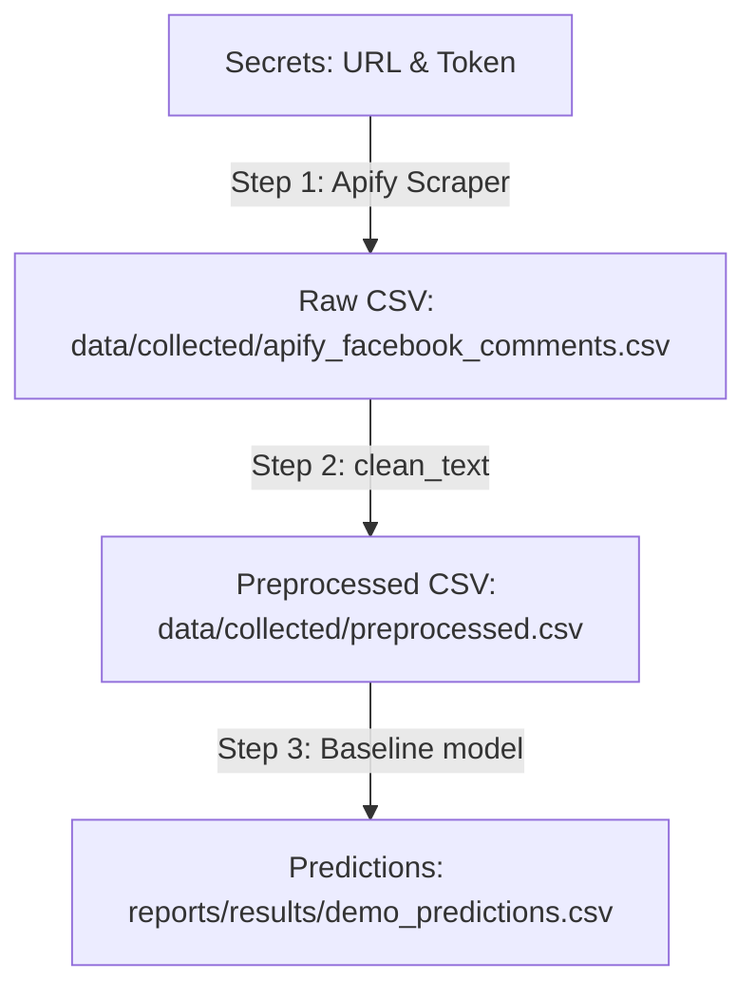

# Scraping & Prediction Demo Walkthrough

We carried out a full demo to verify the data collection (scraping), retrieval, preprocessing, and baseline model prediction pipeline. The demo ran successfully with zero errors across all stages.

Below is the detailed evaluation of each stage of the pipeline.

---

## 🏃 How to Run the Demo

The demo pipeline is implemented as a standalone script [demo_pipeline.py](file:///c:/Users/vdchi/OneDrive/Documents/DATA%20SCIENCE/Sem5/Group%20Project/Prototyping%202/demo_pipeline.py) in the workspace root. You can run it with:

```bash
python demo_pipeline.py
```

---

## 🔍 Stage-by-Stage Evaluation



### [Step 0] Verification of Credentials
- **Apify Token**: Successfully loaded from [apify_token.txt](file:///c:/Users/vdchi/OneDrive/Documents/DATA%20SCIENCE/Sem5/Group%20Project/Prototyping%202/secrets/apify_token.txt).
- **Target URL**: Loaded from [url.txt](file:///c:/Users/vdchi/OneDrive/Documents/DATA%20SCIENCE/Sem5/Group%20Project/Prototyping%202/secrets/url.txt) (`https://web.facebook.com/share/p/1UfxVy7FRx/`).

### [Step 1] Scraping & Retrieval
- **Method**: Synced invocation of the Apify actor `apify/facebook-comments-scraper`.
- **Results**: Collected **5** comments.
- **Output File**: Saved to [apify_facebook_comments.csv](file:///c:/Users/vdchi/OneDrive/Documents/DATA%20SCIENCE/Sem5/Group%20Project/Prototyping%202/data/collected/apify_facebook_comments.csv).
- **Schema & Formatting**:
  The dataframe shape is `(5, 10)`. The columns returned are:
  - `id`: Unique base64 comment ID (e.g. `Y29tbWVudDoxNDY3MTg5NDQ4Nzc4NTc3XzE3MjA5...`)
  - `text`: Raw text of the comment.
  - `source_url`: URL of the Facebook post.
  - `comment_id`: Replicated ID.
  - `author_name`: Author profile name.
  - `created_at`: Datetime in ISO format (e.g., `2026-06-20T12:25:45.000Z`).
  - `collection_source`: `"apify/facebook-comments-scraper"`
  - `raw_item`: JSON representation of the raw record returned by the API.
  - `apify_dataset_id`: Dataset ID.
  - `apify_run_id`: Run ID.

> [!NOTE]
> The retrieved format is extremely rich. Keeping `raw_item` as a JSON string allows us to store arbitrary metadata (such as profile picture URLs, like counts, and reply counts) for future usage without modifying our relational schema.

### [Step 2] Preprocessing
- **Method**: Applied `clean_text` from [preprocess.py](file:///c:/Users/vdchi/OneDrive/Documents/DATA%20SCIENCE/Sem5/Group%20Project/Prototyping%202/src/preprocess.py) to map emoji aliases, clean tags (`<url>`, `<user>`, `<num>`), strip whitespace, and normalize punctuation.
- **Output File**: Saved to [apify_facebook_comments_preprocessed.csv](file:///c:/Users/vdchi/OneDrive/Documents/DATA%20SCIENCE/Sem5/Group%20Project/Prototyping%202/data/collected/apify_facebook_comments_preprocessed.csv).
- **Verification**:
  - Raw comment: `"Before handing out the budget to the public to see, they were like \"damn...\" 😂😂"`
  - Preprocessed: `"before handing out the budget to the public to see , they were like \" damn ... \" 😂😂 emoji_face_with_tears_of_joy emoji_face_with_tears_of_joy"`

### [Step 3] Baseline Model Prediction
- **Model**: `logistic_regression+char_tfidf` (loaded from [best_baseline_model.joblib](file:///c:/Users/vdchi/OneDrive/Documents/DATA%20SCIENCE/Sem5/Group%20Project/Prototyping%202/models/baseline/best_baseline_model.joblib)).
- **Output File**: Saved to [demo_predictions.csv](file:///c:/Users/vdchi/OneDrive/Documents/DATA%20SCIENCE/Sem5/Group%20Project/Prototyping%202/reports/results/demo_predictions.csv).
- **Prediction Results**:
  - The model outputs three prediction scores (representing class probabilities for negative, neutral, and positive sentiment).
  - Calculated the `predicted_label` and `predicted_confidence` based on the highest probability.
  - **Distribution**:
    - `neutral`: 3 comments
    - `positive`: 2 comments

---

## 📈 Error Tracking & Observations

- **Errors Encountered**: **None**. Every stage executed with exit code `0`.
- **System Stability**: The environment imports all dependencies (`apify-client`, `pandas`, `scikit-learn`, `joblib`) correctly.
- **Next Steps for Database Integration**:
  - Raw scraped comments from Step 1 can be loaded directly into a `raw_comments` staging table (using `id` as primary key and `raw_item` as a `JSONB` column to store all retrieved metadata).
  - Preprocessed texts can be pushed to a `preprocessed_comments` table or processed inline.
  - Predictions from Step 3 can be written to a `predictions` table linked to the `comment_id`.
